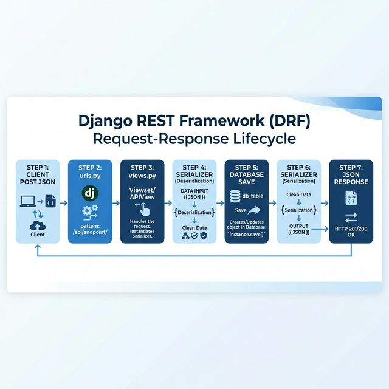

# 🎓 Comprehensive Backend Learning Guide

This guide covers the journey from basic Python concepts to advanced Django/DRF architectural patterns.

---

## 🐍 Phase 1: Python Fundamentals

### 1. Variables & Data Types

- **Integers/Floats**: `x = 10`, `y = 10.5`
- **Strings**: `name = "Python"`. Strings are immutable sequences of characters.
- **Lists**: `tasks = ["Task 1", "Task 2"]`. Ordered, mutable collections.
- **Dictionaries**: `user = {"name": "Gaurav", "id": 1}`. Key-Value pairs (O(1) lookup).
- **Tuples**: `point = (10, 20)`. Immutable ordered collections.

### 2. Control Flow

- **Conditional Logic**:

  ```python
  if status == "pending":
      print("Check later")
  else:
      print("Done")
  ```

- **Loops**:

  - `for task in tasks:` (Used for iterating over collections).
  - `while condition:` (Used for repeated execution until a condition changes).

### 3. Functions & Classes (OOP)

- **Functions**: encapsulate logic for reuse.
- **Classes**: Blueprint for objects.

  - **Inheritance**: `class Job(models.Model)` (Job inherits from Django's Model).
  - **Encapsulation**: Keeping data and methods together.

---

## 🌐 Phase 2: Django & DRF Basics

### 1. The API Request Lifecycle

- **URLs (`urls.py`)**: The entry point. Maps paths to logic.
- **Views (`views.py`)**: The "Brain". Handles the request and returns a response.
- **Serializers**: The bridge between Python objects and JSON. Handlers for **Validation** and **Data Transformation**.

### 2. Serialization vs. Deserialization

This is a very common interview question:

- **Serialization (GET)**: Converting a Python object (Model instance) **TO** JSON. Used for sending data in a response.
- **Deserialization (POST/PUT/PATCH)**: Converting JSON **FROM** a request into a validated Python object. Used for saving data to the database.
- **Key Check**: `serializer = JobSerializer(job)` (Serialization) vs `serializer = JobSerializer(data=request.data)` (Deserialization).

### 3. Why include `id` in Serializers?

- **Identification**: The client (Frontend) needs the `id` to know which specific object to update or delete later.
- **Auto-Read-Only**: DRF automatically marks the Primary Key (`id`) as read-only, so you don't need to pass it in a POST request.

### 4. Application Creation Flow (Visual)

This diagram shows exactly how your `create_application` view works:



**Step-by-Step Breakdown:**

1. **Deserialization**: Serializer converts JSON from `request.data` into a validated Python object.
2. **Validation & Save**: `serializer.is_valid()` checks for errors; `serializer.save()` creates the DB record.
3. **Serialization**: Serializer converts the new Database record back to JSON for the response.

### 5. Django Models & Fields

- **Attributes**: Define columns in your database.
- **`auto_now_add=True`**: Sets date/time automatically on creation.
- **Migrations**: Translating your Python classes into SQL tables.

### 4. Model Relationships (Foreign Keys)

- **Concept**: Linking two tables together. One table "depends" on another.
- **Example**: An `Application` belongs to a `Job`.
- **`on_delete=models.CASCADE`**: If the Job is deleted, all its Applications are also deleted.
- **`related_name="applications"`**: Allows you to access applications from a job object using `job.applications.all()`.

### 5. Model Choices (Enums)

- **What they are**: Restricting a field to a specific list of options.
- **Why use them**: Ensures data integrity (preventing typos like "hired" vs "Hired").
- **Example**:

  ```python
  STATUS_CHOICES = [
      ("applied", "Applied"),
      ("interviewing", "Interviewing"),
  ]
  status = models.CharField(choices=STATUS_CHOICES, default="applied")
  ```

---

## 🏗 Phase 3: Advanced Architectures

### 1. Function Based Views (FBVs) vs ViewSets

- **FBVs**: Fast to write, but you have to manually handle methods and URL routing.
- **ViewSets**: Group logic for `list`, `create`, `retrieve` into one class.
- **Routers**: Automatically handle the `/` and `/<pk>/` logic.

#### 🏰 Before: Function Based Views (FBVs)

*Scattered, manual, and verbose.*

```python
# views.py
@api_view(['GET'])
def get_all(request): ...

@api_view(['POST'])
def create(request): ...

# urls.py
path('get/all/', get_all),
path('create/', create),
```

#### 🏙️ After: ViewSet + Router

*Organized, standardized, and clean.*

```python
# views.py
class ApplicationViewSet(viewsets.ViewSet):
    def list(self, request): ...
    def create(self, request): ...

# urls.py
router.register(r'application', ApplicationViewSet)
```

### 2. ViewSet Migration Checklist
1. **Inherit** from `viewsets.ViewSet`.
2. **Rename** your functions:
   - `get_all_applications` -> `list(self, request)`
   - `create_application` -> `create(self, request)`
   - `get_application_by_id` -> `retrieve(self, request, pk=None)`
3. **Register** in `urls.py` using `DefaultRouter()`.
4. **No DB Migration Needed**: Remember, changing views/logic DOES NOT require `makemigrations` because the table structure didn't change!

### 3. Ultimate Mode: ModelViewSet

- **What it is**: A ViewSet that already knows how to do `list`, `create`, `retrieve`, `update`, `partial_update`, and `destroy`.
- **Why use it**: It reduces your code by 90% if you are doing standard CRUD.
- **Requirements**: You only need to provide two things:
  1. `queryset`: Which data to look at.
  2. `serializer_class`: How to transform that data.

#### 🚀 Minimalist Example

```python
class ApplicationViewSet(viewsets.ModelViewSet):
    queryset = Application.objects.all()
    serializer_class = ApplicationSerializer
```

#### 4. Method-Based Routing

In the `urls.py` of our projects app:

```python
router = DefaultRouter()
router.register(r'', views.ProjectViewSet, basename='project')
urlpatterns = router.urls
```

### 5. Middleware

- **What it is**: Global interceptor for every request.
- **Example**: Our `RequestLoggingMiddleware` for tracking performance.
- **Critical Piece**: Always call `get_response(request)` to continue the chain.

---

## 🗄 Phase 4: Database & Environments

### 2. Environment Management (uv vs venv)

- **venv**: Standard Python tool. Reliable but slow for large dependency trees.
- **uv**: Modern, Rust-based package manager. 
  - **`.venv`**: Just like standard venv, `uv sync` creates a `.venv` folder in your project. You can still use `source .venv/bin/activate` if you want.
  - **`uv run`**: **The "Magic" Command**. Instead of activating the venv every time, you can just run `uv run manage.py runserver`. It handles the environment for you automatically!
  - **Speed**: Up to 100x faster than pip.
  - **Reliability**: Better dependency resolution.

- **Pro Tip: Hardlink Warning**
  If you see `Failed to hardlink files`, it's because your project and the `uv` cache are on different drives. 
  **Fix**: Add `export UV_LINK_MODE=copy` to your `.bashrc` or just ignore it—your code will still work perfectly!

### 3. Identity & Sequences

- **`.env` files**: Keeping secrets (DB passwords, Hostnames) out of the code.
- **127.0.0.1 vs localhost**: Always use `127.0.0.1` in your `.env` to avoid DNS hang issues.

---

## 🛡️ Phase 5: Security & Best Practices

Understanding how to keep your code safe is the difference between a Junior and a Senior engineer.

### 1. Secret Management (.env)

- **Problem**: Hardcoding `SECRET_KEY` or `DB_PASSWORD` in your code is a massive vulnerability. If your code is on GitHub, anyone can see your keys.
- **Solution**: We use **Environment Variables**.
- **Django Implementation**: `SECRET_KEY = env("SECRET_KEY")`. Always keep your `.env` file out of Git (`.gitignore`).

### 2. Built-in Django Protections

Django is "Secure by Default". Here is how it handles the "Big Three" attacks:

| Attack | Description | Django's Shield |
| :--- | :--- | :--- |
| **SQL Injection** | Attacker tries to "inject" SQL code into your DB. | **ORM**: Django's ORM automatically escapes all inputs. You never write raw SQL. |
| **XSS (Cross-Site Scripting)** | Attacker tries to inject malicious JavaScript into your page. | **Templates**: Django templates automatically "escape" HTML tags (turning `<` into `&lt;`). |
| **CSRF (Cross-Site Request Forgery)** | Attacker tries to trick a user into performing an action on your site. | **CSRF Middleware**: Django requires a unique "Token" for every POST request. |

### 3. Debug Mode Warning

- **`DEBUG = True`**: Only for local development. It shows detailed error pages which contain your code and environment details.
- **Production**: Always set `DEBUG = False`.

### 4. Common Server Errors

- **`Error: That port is already in use.`**: This means another server (or a stray process) is already running on port 8000. 
  - **Quick Fix**: Run `fuser -k 8000/tcp` to kill the process, or use a different port: `python manage.py runserver 8001`.
- **`OperationalError: Port expected integer`**: Usually a space or newline missing in your `.env` file!

---

## 🛡️ Phase 6: Soft Deletion (Data Integrity)

In production, we rarely "Hard Delete" (erase) data. Instead, we use **Soft Deletion**.

### 1. Hard Delete vs Soft Delete

| Feature | Hard Delete | Soft Delete (Logical Delete) |
| :--- | :--- | :--- |
| **Action** | `DELETE FROM table WHERE id=X` | `UPDATE table SET is_deleted=True WHERE id=X` |
| **Recovery** | Impossible (unless you have backups) | Instant (just set `is_deleted=False`) |
| **Auditing** | Data is gone forever. | You keep a record of who deleted what and when. |

### 2. Implementation in DRF

To implement this professionally in a `ModelViewSet`, we override two things:

1.  **`get_queryset()`**: To filter out deleted records from all `GET` requests.
2.  **`perform_destroy()`**: To change the `DELETE` action from "erase" to "mark as deleted".

---

### 5. Common Django View Errors

- **`ModuleNotFoundError`**: Usually a typo in the import path (e.g., `from model` instead of `from .models`).
- **`AttributeError: 'Manager' object has no attribute 'object'`**: You typed `Model.object.all()` instead of `Model.objects.all()` (plural).
- **`pk` error**: Forgetting to include `pk` in the URL pattern when your view function expects it for item retrieval.

### 6. Common API Request Gotchas

- **Trailing Slashes**: Django is strict with slashes. `application/create/` is NOT the same as `application/create`.
- **Case Sensitivity in Choices**: If your model has `("applied", "Applied")`, the first value (`applied`) is what the database/API expects. Sending `"Applied"` will cause a validation error.
- **URL Pathing**: Always check both the project `urls.py` AND the app `urls.py`. The paths are combined!
